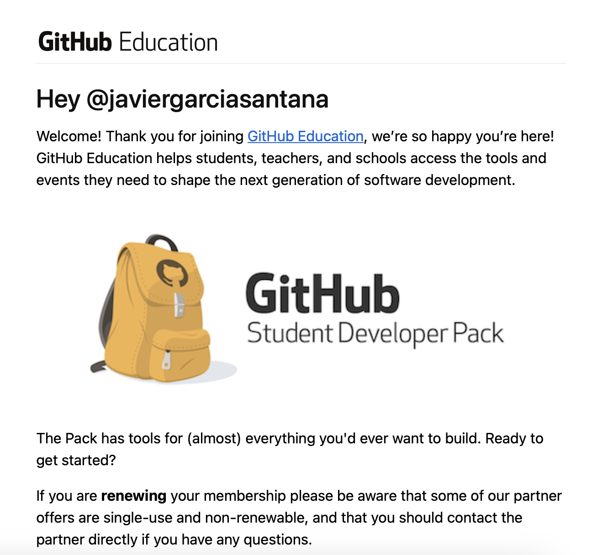

# Github Campus Expert 

- Javier 
- García Santana 
- alu0101391663

## Índice

1. [Rellenar el cuestionario GitHub-Alu del campus virtual y recibir el correo confirmándolo](#rellenar-el-cuestionario-github-alu-del-campus-virtual-y-recibir-el-correo-confirmándolo)
2. [Crear equipo con nombre correcto](#crear-equipo-con-nombre-correcto)
3. [Crear un project board kanban para este repositorio](#crear-un-project-board-kanban-para-este-repositorio)
4. [Solicitar el GitHub Backpack](#solicitar-el-GitHub-Backpack)

## Rellenar el cuestionario GitHub-Alu del campus virtual y recibir el correo confirmándolo

## Crear equipo con nombre correcto

## Crear un project board kanban para este repositorio

## Solicitar el GitHub Backpack

